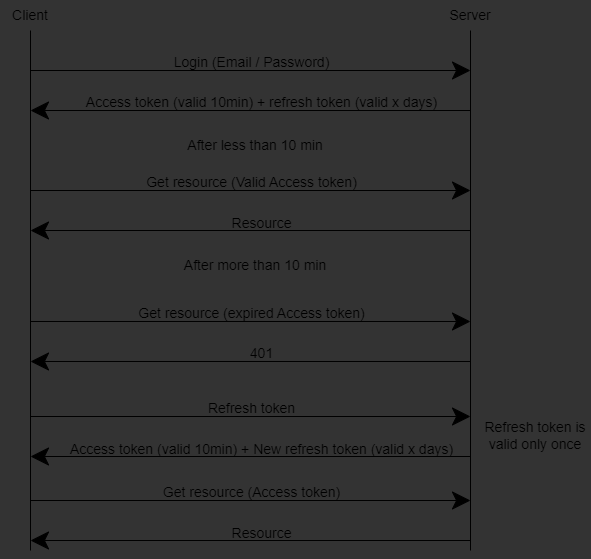

# ASP .NET React TypeScript JWT Auth

## Project Overview

This project is an implementation of an authentication system using ASP.NET, React, and TypeScript with JSON Web Tokens (JWT). It demonstrates how to set up a secure authentication mechanism in a web application, integrating both backend and frontend technologies.


## Important Note

This project is intended as an example and should not be used in production without further modifications and security enhancements. Ensure that you thoroughly review and test the code, and implement necessary security measures before deploying to a live environment.


## Features

- **ASP.NET Backend**: Provides RESTful API endpoints for user authentication and authorization.
- **React Frontend**: Implements the user interface for login, registration, and protected routes.
- **TypeScript**: Ensures type safety and better code maintainability.
- **JWT Authentication**: Secures API endpoints and manages user sessions.


## Prerequisites

- [.NET SDK](https://dotnet.microsoft.com/download)
- [Node.js](https://nodejs.org/)
- [npm](https://www.npmjs.com/)


## Running the Application

1. Fill appsettings.json
    - Connection string to database
    - JWT secret - any long string used to sign JWT
    - not necessary to fill email smtp for development (emails are shown in debug console)
2. Start the backend server using launch profile "Example.Api"
3. Start the frontend development server:
```sh
npm run dev
```


## Usage

- Open your browser and navigate to `https://localhost:7132` to access the application.
- Use the registration form to create an account.
- Check Debug console in VisualStudio (where backend is running) and use url to verify email
- Now you can login


## EntityFramework

If you make changes to the database schema, create a migration with command:
`PM> Add-Migration -Project Example.Data -Name name_of_migration`


## Authentication

- This example uses access tokens and refresh tokens, both sent via HttpOnly cookies, with the restriction that the refresh token is sent only to a specific endpoint "/api/auth".
- Both cookies have the same expiration because the 'refresh-token' endpoint requires the access token, even if it is expired, to generate a new tokens.

Authentication Flow Overview  



## License

This project is licensed under the MIT License. See the [LICENSE](LICENSE) file for details.
